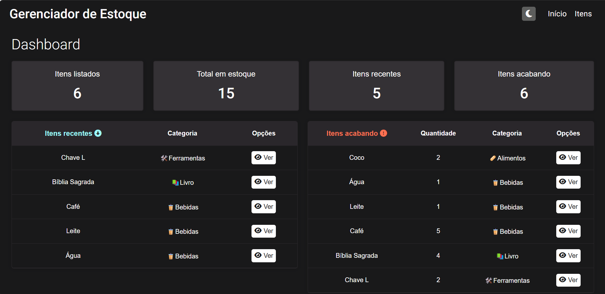

# Gerenciador Estoque

</img>

Este projeto é uma aplicação web desenvolvida em Angular que representa um gerenciador de estoque. Os objetivos principais para a criação desse projeto foram: primeiro, representa um solução para uma necessidade real do cotidiano; segundo, colocar em prática os meus conhecimentos de Angular para o desenvolvimento de um projeto do zero.

## 📋 Funcionalidades
- **Criação de itens:** o usuário pode adicionar novos itens a tabela de itens. O usuário poderá preencher as seguintes informações do item:
  - Nome
  - Quantidade
  - Valor
  - Categoria
  - Descrição (opcional)

- **Visualização de item:** o usuário pode visualizaro um item, ao clicar no botão "ver". Após isso, o sistema trará uma página com todas as informações do item, bem como o seu registro de alterações.

- **Edição de Itens:** itens já adicionados podem ser editados para corrigir ou ajustar suas informações.

- **Exclusão de Itens:** os itens podem ser excluídos, onde, ao clicar em excluir, um pop-up é aberto para o usuário confirmação a exclusão.

- **Registro de alterações:** cada item possui um registro de alterações, onde ficará registrado toda alteração que for feita.

  - **Exclusão de registro:** o usuário poderá resetar o registro de cada item.

- **Adicionar categoria:** o usuário poderá adicionar uma nova categoria a lista de categorias.

- **Exclusão de categoria:** o usuário poderá excluir uma categoria da lista de categorias.

- **Filtragem de itens por categoria:** o usuário poderá selecionar um categoria específica para que sejam exibidas apenas os itens da categoria em questão.

- **Exibição de itens recentes:** na página incial, o sistema exibe os 10 ultimos itens adicionados ao estoque.

- **Exibição de itens com baixa quantidade:** na página incial, o sistema exibe todos os itens que possuem uma quantidade menor ou igual a 10.

- **Mudança de tema:** o usuário poderá escolher entre o tema escuro e claro. 

## 🛠️ Requisitos Técnicos
- **Validação de Formulários:** validações básicas garantem que itens não tenham campos inválidos ou incoerentes.

- **Responsividade:** a aplicação se adapta para funcionar de maneira eficaz em diferentes dispositivos e tamanhos de tela.

- **Pessistência de dados:** a aplicação está usando o localStorage para armazenar os itens do usuário.

## 🚀 Tecnologias Utilizadas
 - **Angular:** framework usado para construção da aplicação web.
 - **HTML/CSS:** Para a estrutura e estilização da interface.
 - **TypeScript:** Linguagem utilizada para a lógica da aplicação.

## 💻 Como Executar o Projeto
1. **Acesse o link:** https://gerenciador-estoque-angular.vercel.app/

## 📄 Licença
Este projeto está sob a licença MIT. Consulte o arquivo LICENSE para mais informações.
